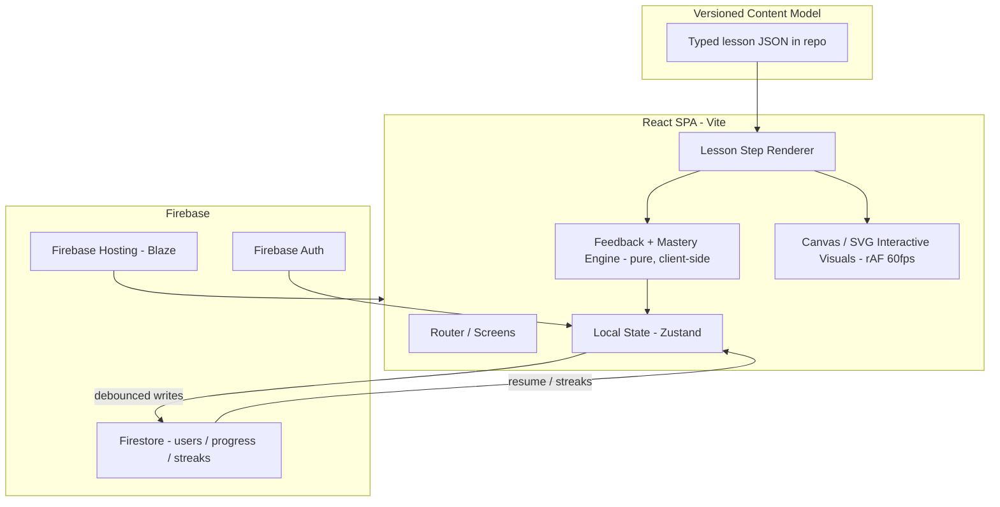

# Blazing Audio - Product Requirements Document

> A Brilliant-style, mobile-first interactive learning app that teaches home-audio
> fundamentals through one deep, building course thread - from the shape of a sound
> wave to safely powering a speaker. Built on Vite + React + TypeScript with Firebase
> (Auth, Firestore, Hosting). Zero AI in the MVP: every problem, visual, and piece of
> feedback is hand-built.

---

## 1. Summary

Blazing Audio teaches people who are new to home audio how sound and speakers actually
work, using short, hands-on lessons instead of videos or walls of text. Each lesson is a
sequence of interactive steps: a concept, a problem the learner manipulates directly, and
instant, specific, hand-written feedback that explains the idea behind it.

The MVP proves one thing: **a single hand-built lesson can make a hard idea click without
any AI doing the work.** Everything else (the course path, streaks, mastery, persistence)
exists to support that and to make people come back tomorrow.

## 2. Goals and non-goals

### Goals
- Teach a real, ordered slice of audio knowledge where each lesson builds on the last.
- Ship at least one rich, hand-built interactive lesson that genuinely teaches.
- Make feedback instant (< 100 ms) and specific - never just a red X.
- Persist progress, streaks, and history across sessions and devices.
- Work great on a phone with touch input.
- Be deployed and public.

### Non-goals (MVP)
- No AI / model calls / chatbot tutor of any kind.
- No social features (comments, leaderboards, sharing).
- No full breadth of audio topics - depth over breadth.
- No native mobile apps - responsive web only.

## 3. Target user persona

**"Sam, the nervous new hi-fi owner" (ages 28-45)**

- Just bought, or is about to buy, a pair of passive bookshelf speakers and an
  amplifier/receiver for a home setup.
- Knows the words - "amplifier," "watts," "frequency" - but not what they mean or how the
  pieces connect.
- Real fear: wiring something wrong, mismatching power, and **frying gear they paid for.**
- Learns in short bursts on a **phone**, usually evenings and weekends.
- Motivated by two feelings: the "I finally get it" click, and the relief of knowing they
  will not break expensive equipment.

Every screen, example, and line of feedback is written for Sam: concrete, reassuring, and
framed around real home audio - not an electrical-engineering textbook.

## 4. The subject, stated clearly

**Sound & Speakers - how audio actually works, from the shape of a sound wave to safely
powering a speaker in your home.**

## 5. The course (depth over breadth)

One course. One ordered path. Each lesson reuses the concept from the lesson before it, so
a learner who starts knowing almost nothing comes out understanding something real.

| #  | Lesson                          | Core ideas                                                                                                   | Builds on |
|----|---------------------------------|--------------------------------------------------------------------------------------------------------------|-----------|
| 1  | Anatomy of a Sound Wave         | Sine wave: amplitude (loudness), frequency (pitch), wavelength, period.                                       | -         |
| 2  | Frequency, Pitch & Response     | The audible range (20 Hz-20 kHz); why a speaker is not equally loud at every frequency; reading a response curve. | 1     |
| 3  | How a Speaker Makes That Wave   | Voice coil, magnet/motor, cone, + / - terminals; electrical signal -> coil movement -> cone -> the wave from Lesson 1; polarity. | 1 |
| 4  | Powering a Speaker Safely       | What an amplifier does; RMS vs peak watts; matching amp power to a speaker's RMS so the voice coil from Lesson 3 does not overheat. | 3 |
| 5  | Clipping: When the Signal Breaks| Gain vs volume; what the amp's knobs and the clip light mean; pushing gain past headroom flattens the sine wave into a near-square wave that fries the voice coil. | 1, 3, 4 |

The path closes a full arc: **wave -> speaker -> power -> what destroys it.** Later
lessons (subwoofer placement and room gain, RCA and balanced vs unbalanced, Thiele/Small
parameters) can slot in without re-architecting.

> Build process note: lessons are designed and built **one at a time**, with the exact
> interaction, visual, and feedback for each lesson confirmed with the product owner before
> it is built.

## 6. What a lesson is

A lesson is a short (a few minutes) sequence of **steps**. Each step is one of:

- **Concept** - a short, plain-language idea, optionally with an explorable (ungraded)
  visual the learner can poke at.
- **Problem** - a prompt plus one interaction the learner manipulates, plus hand-written
  feedback.

Every answer gets **instant, specific feedback**. A wrong answer gets a hint or an
explanation matched to *what* the learner did wrong, then the "idea behind this" - never a
bare red X. Lessons are kept short so finishing one feels good.

### Interaction types
The MVP includes the baseline plus rich, subject-specific interactions (the exact set per
lesson is confirmed during design):

- `multipleChoice` - baseline, single or multi-select.
- Direct-manipulation types such as a slider/knob that drives a live waveform, a draggable
  diagram, tap-to-wire polarity, reorder-the-steps, and a power/headroom meter.

Each interaction type is one React component plus one **pure** `grade()` function, so
adding a lesson is mostly authoring content, and adding an interaction is one component
plus one grader.

## 7. Feedback (hand-written, never generated)

Feedback for every problem is authored by the team and stored in the content model:

```
feedback: {
  correct:           "...",              // shown on a right answer
  incorrect:        [{ match, text }],   // matched to specific wrong patterns
  defaultIncorrect:  "...",              // fallback for any other wrong answer
  insight:           "..."               // "the idea behind this", always shown after
}
```

This guarantees feedback is specific to the mistake and consistent in voice, with no model
calls and no latency.

## 8. Architecture



### Key decisions
- **Content is versioned, typed data in the repo** (not Firestore) for the MVP: instant
  load, no read latency or cost, easy hand-authoring, and a model designed so it can later
  move to Firestore or be AI-generated with no renderer changes. This satisfies "a content
  model, not a blob of HTML."
- **Feedback and mastery are pure, client-side functions** over that model, which
  guarantees sub-100 ms feedback with no network round-trip.
- **Firestore stores only user data** (profile, per-lesson progress, streaks) with
  debounced writes, so it scales cheaply to many concurrent learners.
- **Visuals use Canvas 2D + requestAnimationFrame** for waveforms (smooth slider
  scrubbing) and SVG + animation for diagrams.

## 9. Data model (Firestore)

```
users/{uid}
  displayName, email, createdAt
  streak:  { current, longest, lastActiveDay }   // lastActiveDay is YYYY-MM-DD
  stats:   { lessonsCompleted, problemsSolved, xp }

users/{uid}/lessonProgress/{lessonId}
  status:           'notStarted' | 'inProgress' | 'completed'
  currentStepIndex: number
  stepStates:       { [stepId]: { answered, correct, attempts } }
  masteryScore:     number    // 0..1, from correct-on-first-try ratio
  startedAt, completedAt, updatedAt
```

- **Mastery / next step:** the path unlocks sequentially. "Continue" points at the first
  in-progress or not-started lesson. If a completed lesson's `masteryScore` is below a
  threshold, the path surfaces a "Review" call to action before recommending the next
  lesson.
- **Streak:** on each completed step, compare `lastActiveDay` to today and increment or
  reset. Milestones fire at 3- and 7-day streaks and on each lesson completion.
- **Security rules:** a user can read and write only their own `users/{uid}` document and
  subcollections. Content ships in the bundle, so it needs no rules unless later moved to
  Firestore.

## 10. Tech stack

- **Vite + React + TypeScript**, React Router, Zustand for state.
- **Firebase JS SDK**: Auth (email/password + Google) and Firestore. **Firebase Hosting**
  (Blaze plan) for deployment.
- **Tailwind CSS** (mobile-first), animation for diagrams, **Canvas 2D** for waveforms.
- Tooling: ESLint + Prettier; Firebase CLI with the local emulator suite.

## 11. Success metrics and performance targets

- Feedback on an answer appears in **under 100 ms**.
- Interactive visuals stay smooth at **60 FPS** while being manipulated.
- Lessons reach first interaction in **under 2 seconds**.
- Works on **mobile screen sizes with touch input**.
- Holds up with **multiple concurrent learners** with no slowdown.

## 12. Test plan (MVP scenarios)

1. A learner completes one lesson end to end, gets some problems wrong, and uses the
   feedback to recover.
2. A learner manipulates the interactive element and watches the visual respond in real
   time.
3. A learner leaves mid-lesson and returns (reload or a different device) to confirm
   progress and streak persist.
4. A learner finishes a lesson and sees the path recommend a sensible next step.
5. The whole flow works on a phone-sized screen with touch.

## 13. Deliverables

- This PRD (`docs/PRD.md`).
- A running, deployed app on Firebase Hosting (public URL).
- Seeded, typed lesson content for Lessons 1-5 (built incrementally).
